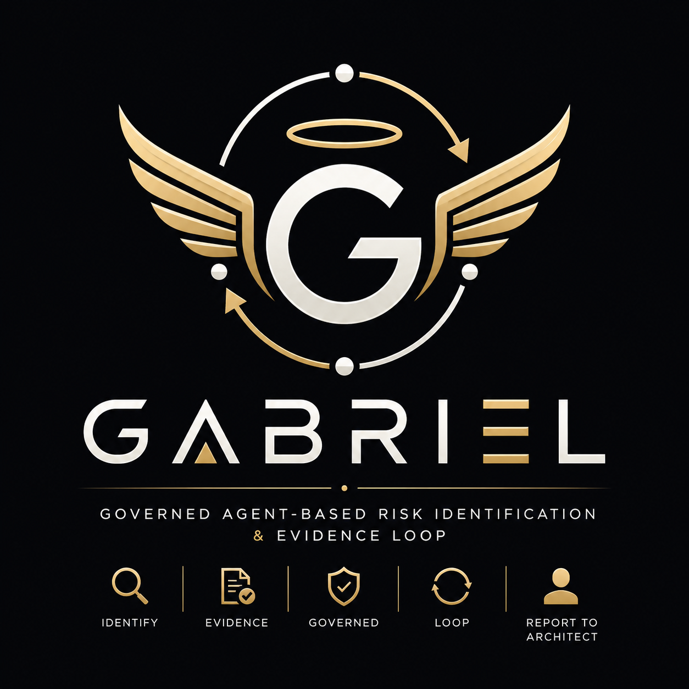

# GABRIEL

**Governed Agent-Based Risk Identification & Evidence Loop**

Independent, evidence-driven audit framework composed of specialized out-of-band agents that identify project risks and report verified findings to the ARCHITECT.

> **"Loop" means continuous audit cycle** — GABRIEL runs at phase transitions to collect fresh evidence. It is not an execution loop that acts on the project. GABRIEL observes, reports, and stops.

---

## Architecture



---

## Members

| Member | Question | Perspective |
|--------|----------|-------------|
| **SCAFFOLD_CHECKER** | Is the implementation coherent with canonical artifacts? | Inside-out |
| **BLACKBOX_BUGHUNTER** | Can the product be broken by an informed user? | Outside-in |
| **RELEASE_AUDITOR** | Is the release artifact operationally complete? | Artifact |
| **PREMORTEM** | What could go wrong if we ship this? | Failure-mode |

---

## Quick Start

```bash
# Meta-audit — determine project phase + completeness
@gabriel <target-path>

# Scaffold check — inside-out coherency
@scaffold_checker <target-path>

# Blackbox audit — hack/boilerplate patterns
@blackbox_bughunter <target-path>

# Release audit — artifact completeness
@release_auditor <target-path>

# Premortem — failure-mode analysis
@premortem <target-path>
```

---

## Phase FSM

Projects move through phases based on artifact presence:

```
Scaffold ──► Development ──► Pre-release ──► Release ──► Post-build ──► Ready to Ship ──► Published
```

| Phase | Entry Condition |
|-------|----------------|
| Scaffold | `SPEC.md` missing |
| Development | `SPEC.md` exists, `CHANGELOG.md` missing |
| Pre-release | `CHANGELOG.md` exists, no Git tag |
| Release | Git tag == latest CHANGELOG version |
| Post-build | Release + `build/` has distributables |
| Ready to Ship | Post-build + `deploy/` exists + signed |
| Published | deploy/ published + release notes |

**Regression rule:** Later artifacts removed → phase regresses automatically.

---

## Audit Protocol

Every finding follows the **Reproducibility Standard**:

```
Observed:  <what is actually there>
Expected:  <what should be true>
Evidence:  <file:line + quote | path + hash | screenshot>
```

### Evidence Hierarchy

| Tier | Source | Acceptable for Findings? |
|------|--------|--------------------------|
| **1 — Direct** | Filesystem, git, binary | ✅ Yes |
| **2 — Build** | Build logs, CI logs | ✅ Yes |
| **3 — Visual** | Screenshots, recordings | ✅ Yes |
| **4 — Verbal** | User reports, conversation | ⚠️ Low confidence |
| **5 — Assumption** | Inference without source | ❌ Never |

---

## Severity Scale

All auditors normalize to a global scale:

| Global | SCAFFOLD | RELEASE | PREMORTEM | BUGHUNTER |
|--------|----------|---------|-----------|-----------|
| **Blocking / Critical** | Blocking | Blocking | Critical | Critical |
| **Should-Fix / Major** | Should-Fix | Should Release-Fix | Major | Major |
| **Note / Minor** | Note | Note | Minor | Minor |
| **Cosmetic** | — | — | Cosmetic | Cosmetic |

---

## Conflict Resolution

When multiple auditors produce findings on the same subject:

- **ARCHITECT resolves.** Auditors never negotiate or vote.
- No cross-auditor consensus mechanism.
- This preserves independence.

---

## Files

```
GABRIEL/
├── GABRIEL.md          # Framework specification
├── scaffold_checker.md  # SCAFFOLD_CHECKER agent spec
├── THE_FINALIZER.md    # BLACKBOX_BUGHUNTER agent spec
└── README.md           # This file
```

---

## Principles

1. **Out-of-Band** — Auditors never participate in design or execution
2. **Stateless** — Each session starts fresh; continuity is ARCHITECT's job
3. **Read-only** — Never modify artifacts
4. **Evidence-backed** — Every finding cites source
5. **Never auto-remediate** — Describe only, never fix
6. **Never gate** — Report findings, don't block
7. **Hand to ARCHITECT** — Decisions belong to the architect

---

**GABRIEL** · Framework v1.0
